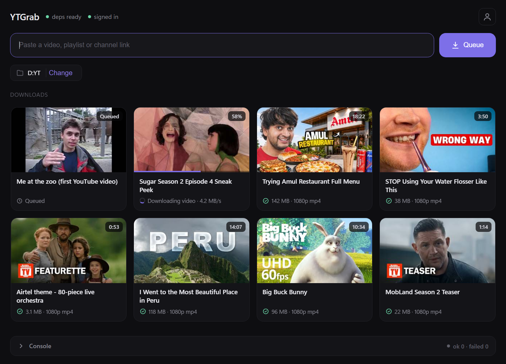

# YTGrab

A fast, modern **yt-dlp GUI for Windows**. Paste a link, pick a quality, and your
videos land in a clean gallery — no command line, no setup. The UI is rendered by
WebView2 (already part of Windows 11), so it's a single ~15 MB app with no bundled
browser.



## Features

- **Gallery of downloads** — each video is a card with its thumbnail, channel,
  size, format and live progress. History persists across restarts.
- **Play / reveal / delete** — double-click a finished video to play it, open its
  folder, or delete it (sent to the Recycle Bin, so it's recoverable).
- **Auto or Custom quality** — Auto prefers your codec (VP9 → AV1 → H.265, or
  Legacy H.264) at your chosen resolution; Custom lets you pick a specific format
  from the video's real available streams. Audio is always the best track.
- **Playlists & channels** — each video is queued and fully processed (merge,
  thumbnail/metadata embed, upload-date timestamp, mark-watched) the moment it
  finishes, before the next one starts.
- **No cookie files** — sign into YouTube once inside the app's own browser;
  cookies stay in the encrypted profile. "Mark as watched" is done through
  YouTube's own history, so downloads themselves stay anonymous.
- **Skip download** — just mark a video watched without downloading it.
- **Self-managing tools** — yt-dlp updates itself on launch; ffmpeg is bundled.
- **Queue** — downloads run one after another; failed items get a retry button.

## Install

Grab the latest from the [**Releases**](https://github.com/thissaksham/YTGrab/releases/latest) page:

- **`YTGrab-Setup-x.y.z.exe`** — installer (recommended). Pick a location, get
  shortcuts and a clean uninstall. ffmpeg is bundled and the latest yt-dlp is
  fetched during setup, so it opens ready to use.
- **`YTGrab.exe`** — portable single file. Downloads its tools on first launch.

Requires Windows 10/11 with the WebView2 runtime (preinstalled on Windows 11).
The app is unsigned, so SmartScreen warns on first run — choose "More info", then
"Run anyway".

## Build from source

```
pip install pywebview pyinstaller
python -m PyInstaller --onefile --windowed --name YTGrab --icon ytgrab.ico ytgrab.py
```

Everything lives in one file: [`ytgrab.py`](ytgrab.py). App data (tools, browser
profile, config, history) lives in `%LOCALAPPDATA%\YTGrab`. The installer is built
with [Inno Setup](https://jrsoftware.org/isinfo.php) from
[`installer.iss`](installer.iss). `legacy/` holds the batch-script workflow YTGrab
replaced.

## Note

For personal use. Respect the terms of service of the sites you download from, and
only download content you have the right to save.
